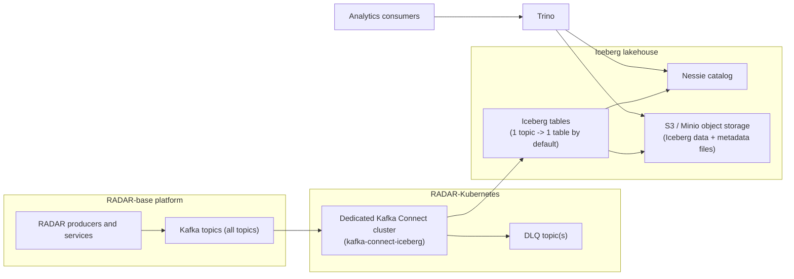

Summary
-------
This RFC proposes a production-ready architecture to export all RADAR-base Kafka topics into Apache Iceberg tables stored in S3, using a dedicated Kafka Connect deployment on Kubernetes and Project Nessie as the Iceberg catalog. The design focuses on operational reliability, schema-safe evolution, configurable key/value field mapping, and query access through Trino.

Motivation
----------
RADAR-base currently relies on Kafka as the central event backbone, while analytical and downstream use cases require durable, query-optimised, table-formatted storage. A direct Iceberg sink path provides:

- open table format semantics for long-term analytics,
- efficient query access with Trino,
- better schema governance than ad hoc object writes,
- lifecycle operations such as snapshot management and compaction.

This RFC aims to standardise that path in RADAR-Kubernetes and radar-helm-charts with production deployment constraints.

Non-Goals
---------
- Defining a full semantic data model redesign for RADAR topics.
- Implementing broad stream transformation logic beyond connector mapping/routing needs.

Guide-level explanation
-----------------------
At a high level, the platform will run a dedicated Kafka Connect cluster that hosts an Iceberg sink connector plugin:

1. Kafka Connect consumes RADAR-base topics.
2. Connector mapping rules read fields from Kafka keys and/or values.
3. Records are written into Iceberg tables in S3 or Minio.
4. Table metadata is maintained in Nessie.
5. Trino reads Iceberg snapshots through the Nessie catalog.

The deployment is fully Kubernetes-native and managed via Helm charts and RADAR-Kubernetes environment values. Because this is production-ready from day one, the rollout includes all topics, with strict observability and acceptance gates.

### Architecture diagram

Reference-level design
----------------------
### Architecture

- Dedicated connector runtime:
  - Deploy a dedicated `kafka-connect-iceberg` runtime in RADAR-Kubernetes.
  - Keep independent resource sizing, scaling, and upgrade cadence from other connectors.
- Catalog and storage:
  - Iceberg catalog: Project Nessie.
  - Object storage: S3 buckets (private by default, encrypted at rest).
- Query consumer:
  - Trino is the primary read engine for Iceberg tables.

### Topic-to-table strategy

- Default mapping policy: **1 Kafka topic -> 1 Iceberg table**.
- Naming convention must be deterministic and environment-aware.
- Explicit override rules are supported when a topic needs custom table naming or partition spec.

### Key/value mapping model

Connector configuration supports:

- key-based routing and partition dimensions,
- value-field projection,
- merged key+value mapping into target Iceberg schema,
- configurable mapping profiles per topic.

This is required to support observation key-driven modelling and source variability without custom code for each topic.

### Delivery and write semantics

- Production profile targets duplicate-safe and replay-safe behaviour.
- Record identity strategy combines platform offsets and optional business identifiers.
- Failed records are handled by retry strategy and dead-letter queue (DLQ) pathways.
- Error classes include:
  - schema incompatibility,
  - serialisation/deserialisation failures,
  - catalog commit failures,
  - object storage write failures.

### Schema compatibility policy

- Cluster default policy: **backward-compatible only**.
- Breaking schema changes must fail fast with alerting.
- Optional per-topic stricter policy may be configured by operators.

### Partitioning and file layout

- Baseline partitioning includes event-time dimensions.
- Optional secondary dimensions (for example project or source attributes) are configurable per table.
- File sizing, commit interval, and compaction policy are tunable and documented for operational SLOs.

### Kubernetes and chart integration

Changes span deployment and configuration layers:

- `radar-helm-charts`:
  - add/extend chart support for dedicated Kafka Connect Iceberg runtime,
  - ship connector plugin configuration patterns,
  - provide secure defaults for S3 and Nessie connectivity.
- `RADAR-Kubernetes`:
  - add environment toggles and values wiring for the dedicated runtime,
  - define default production resources and readiness/liveness behaviour,
  - integrate secrets and identity bindings needed for S3/Nessie access.

### Deployment artefact policy (published-first)

This RFC requires a published-first deployment strategy:

- Prefer already published Helm charts for stateful/query services.
- If a suitable Helm chart is unavailable, use an already published container image.
- Build custom images only as a last resort, with explicit justification in release notes.

Concrete choices for this RFC:

- Trino: use published Trino Helm chart (`trino/trino` from `https://trinodb.github.io/charts/`).
- Nessie: use published Nessie Helm chart (`nessie-helm/nessie` from `https://charts.projectnessie.org`).
- Iceberg sink runtime:
  - no standalone "Iceberg server" chart is required for the chosen architecture, because catalog responsibilities are handled by Nessie;
  - use a published container image for Kafka Connect + Iceberg sink connector runtime (class `org.apache.iceberg.connect.IcebergSinkConnector`);
  - if a REST catalog service is introduced later, prefer a published Helm chart for that service at that time.

### Concrete implementation steps

The following delivery steps are normative for the first production release.

1. Connector technology decision and pinning
   - Use the Apache Iceberg community Kafka Connect sink connector from the Iceberg project.
   - Connector class: `org.apache.iceberg.connect.IcebergSinkConnector`.
   - Pin a tested connector version and image tag in deployment manifests and release notes.

2. Build and package connector runtime image
   - Prefer an already published container image for `kafka-connect-iceberg` runtime.
   - Validate that the selected image includes:
     - the Iceberg sink connector plugin,
     - required converters/serialisers used by RADAR topics,
     - Nessie/S3 dependencies required by the chosen connector version.
   - Mirror the approved published image into the organisation registry with immutable tags.
   - If no acceptable published image passes validation, build from upstream Iceberg Kafka Connect distribution as an exception path.

3. Extend `radar-helm-charts` for dedicated Connect deployment
   - Add chart values for:
     - image and plugin version pinning,
     - worker count and task parallelism,
     - connector resource limits/requests,
     - Kafka bootstrap and security settings,
     - Nessie endpoint and branch/reference,
     - S3/Minio endpoint, bucket, region, and credentials source.
   - Add secure defaults for private object storage and encrypted-at-rest configuration.

4. Extend `RADAR-Kubernetes` environment wiring
   - Add environment-level toggles and defaults for enabling `kafka-connect-iceberg`.
   - Wire secrets for S3/Minio access and Nessie authentication.
   - Provide default values for production sizing and availability.

5. Define connector configuration template
   - Topic scope: include all RADAR topics required by the platform.
   - Mapping profile:
     - support routing by key/value fields,
     - support projected value-only fields,
     - support merged key+value fields.
   - Table naming profile:
     - default `1 topic -> 1 table`,
     - explicit override map for special cases.
   - Schema settings:
     - backward-compatible evolution only by default,
     - fail-fast on breaking changes.
   - Partition settings:
     - default event-time partitioning,
     - optional secondary partitions for selected topics.

6. Create Nessie namespace and Iceberg table bootstrap process
   - Define environment namespace and branch strategy in Nessie.
   - Ensure table creation policy is explicit (auto-create controlled by configuration and governance policy).
   - Validate table properties for retention and compaction readiness.

7. Deploy and validate in pre-production
   - Deploy `kafka-connect-iceberg` via Helm.
   - Verify connector task health, consumer lag, write throughput, and DLQ behaviour.
   - Run schema evolution tests:
     - backward-compatible additions succeed,
     - incompatible changes are rejected with alerts.

8. Trino integration verification
   - Configure Trino Iceberg catalog against Nessie and object storage.
   - Execute validation query suite across representative high-volume topics.
   - Compare record counts and key aggregations between Kafka source windows and Iceberg snapshots.

9. Production release and burn-in
   - Enable full topic ingestion in production.
   - Monitor required metrics and alerts for the 14-day burn-in period.
   - Keep rollback path ready: disable connector tasks and revert image/chart/config versions.

10. Operational hardening completion
   - Finalise runbooks for DLQ replay, schema incidents, and connector upgrade/rollback.
   - Confirm compaction and snapshot expiry jobs are active.
   - Record version compatibility matrix (Kafka Connect, Iceberg connector, Nessie, Trino, Helm chart).

### Observability and SLOs

Required metrics and alerts include:

- Kafka consumer lag and task health,
- record throughput and end-to-end ingest latency,
- write failure rate by error class,
- DLQ rate and backlog,
- schema rejection count,
- Iceberg snapshot/metadata growth indicators.

### Production acceptance gate

Production acceptance requires:

- all configured topics actively ingested into Iceberg,
- Trino validation queries passing on representative datasets,
- no critical unresolved alerts for a **14-day burn-in period**.

Compatibility and migration
---------------------------
This RFC introduces a new export path without replacing Kafka or existing operational data paths.

- Existing topic producers remain unchanged.
- Consumers not using Iceberg remain unaffected.
- Iceberg table creation and topic mappings are introduced declaratively.
- Rollback is achieved by disabling connector tasks and reverting chart/config/plugin versions.

Alternatives considered
-----------------------
1. Two-stage export (Kafka -> Parquet files -> later Iceberg ingestion)
   - Pros: simpler initial sink setup.
   - Cons: delayed availability, additional pipeline complexity, weaker real-time analytics behaviour.

2. Streaming compute writer (for example Flink/Spark Structured Streaming -> Iceberg)
   - Pros: rich transformation capabilities.
   - Cons: substantially higher operational complexity for first production delivery.

3. Dedicated Kafka Connect + direct Iceberg sink (**chosen**)
   - Pros: aligns with Kubernetes + Helm operations, faster production delivery, clear operational ownership.
   - Cons: requires strict plugin/version governance and careful schema policy controls.

Operational considerations
--------------------------
- Use dedicated runtime isolation (`kafka-connect-iceberg`) for scaling and fault containment.
- Pin connector/plugin and chart versions.
- Define explicit runbooks for:
  - schema incompatibility incidents,
  - DLQ growth,
  - replay/backfill from Kafka offsets,
  - connector upgrade and rollback.
- Retention, compaction, and snapshot expiration policies must be enabled to control storage and metadata growth.

Security and privacy
--------------------
- S3 buckets are private and encrypted at rest by default.
- IAM permissions follow least privilege for connector writers and Trino readers.
- Secret material (access keys/tokens/endpoints) is managed through Kubernetes secrets and chart values, not hardcoded configs.
- Connector logs and diagnostics must avoid raw sensitive payload leakage by default.
- KMS-based encryption hardening is documented as a follow-up security enhancement track.

Testing strategy
----------------
Testing must cover:

- Unit tests for mapping configuration parsing and key/value projection logic.
- Integration tests for Kafka -> Connect -> Iceberg writes with Nessie catalog.
- Schema evolution tests:
  - backward-compatible updates pass,
  - breaking changes fail with expected alerts.
- End-to-end tests validating Trino queryability and record correctness for representative topics.
- Failure-path tests for DLQ behaviour, transient storage/catalog errors, and restart recovery.
- Performance validation for throughput, file-size behaviour, and connector stability under sustained load.

Success criteria:

- Full configured topic coverage in production.
- Stable ingestion with acceptable lag and error rate under normal operating conditions.
- Query correctness and freshness validated through Trino acceptance suites.

Open questions
--------------
- Which exact topic families need custom partition overrides beyond the default policy?
- Should stricter compatibility (for example full compatibility) be mandated for selected high-criticality topics?
- What SLO thresholds should be formalised for ingest latency and failure rate per environment?
- Which compaction cadence best balances query performance and storage cost for RADAR workloads?

References
----------
- RADAR helm charts repository: https://github.com/RADAR-base/radar-helm-charts
- RADAR-Kubernetes repository: https://github.com/RADAR-base/RADAR-Kubernetes
- Apache Iceberg: https://iceberg.apache.org/
- Apache Iceberg Kafka Connect: https://iceberg.apache.org/docs/latest/kafka-connect/
- Iceberg sink connector class reference: https://iceberg.apache.org/javadoc/1.6.0/org/apache/iceberg/connect/IcebergSinkConnector.html
- Project Nessie: https://projectnessie.org/
- Nessie Helm chart repository: https://charts.projectnessie.org/
- Trino Iceberg connector docs: https://trino.io/docs/current/connector/iceberg.html
- Trino Helm chart repository: https://trinodb.github.io/charts/
- Trino Helm chart source: https://github.com/trinodb/charts
- RADAR-base RFC template: `rfcs/0000-template.md`
