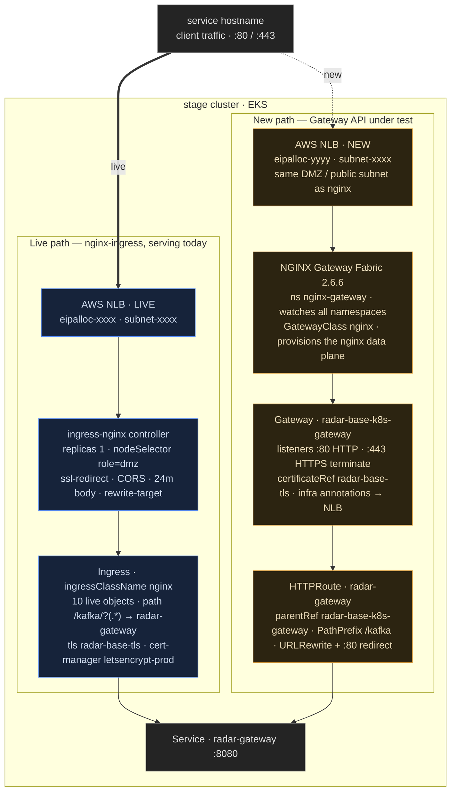

Summary
-------
This RFC proposes migrating RADAR-base ingress from the annotation-driven [NGINX Ingress Controller](https://github.com/kubernetes/ingress-nginx) to the [Kubernetes Gateway API](https://gateway-api.sigs.k8s.io/), implemented by [NGINX Gateway Fabric (NGF)](https://github.com/nginx/nginx-gateway-fabric). The two stacks run **in parallel**: NGINX Ingress keeps serving production traffic on its own load balancer while the Gateway API stack is stood up alongside it, validated one service at a time, and cut over per-service. The rollout starts on the **stage** cluster with **radar-gateway** as the first migrated service, then promotes to production. Because both stacks serve concurrently and traffic is shifted one service at a time, the migration follows a **canary / blue-green** pattern (the legacy stack is "blue", the Gateway stack is "green"), which per-service DNS cutover — or a weighted split as a good-to-have — makes trivially reversible. Everything is delivered as Helm charts and wired through Helmfile behind `_install` flags, so the entire stack is GitOps-managed and reversible.

Motivation
----------
RADAR-base routes all external HTTP(S) traffic through NGINX Ingress. Ingress works, but it has structural limitations that Gateway API is designed to fix:

- **The Ingress API is frozen.** The core `networking.k8s.io/Ingress` resource receives no new features. Every capability beyond basic host/path routing (TLS options, redirects, timeouts, header manipulation, canary/traffic-splitting) is expressed through **controller-specific annotations** on the Ingress object. Those annotations are not portable and not validated by the API server.
- **No separation of concerns.** A single Ingress object mixes infrastructure config (listeners, TLS, load-balancer settings) with application routing (host/path → service). There is no clean boundary between the person who owns the cluster edge and the team that owns a service's routes.
- **Vendor lock-in through annotations.** Our routing behaviour is encoded in `nginx.ingress.kubernetes.io/*` annotations. Moving to any other data plane means rewriting all of them.

Gateway API is the successor the Kubernetes project has standardised on. It replaces the annotation soup with **typed, role-oriented resources**:

- **`GatewayClass`** — the controller/implementation (cluster-operator concern).
- **`Gateway`** — listeners, ports, and TLS at the cluster edge (infrastructure-provider concern).
- **`HTTPRoute`** — hostname/path matching and backend selection (application-developer concern).

**Measurable goals:**
- Replace `nginx.ingress.kubernetes.io/*` annotations with typed, API-server-validated `Gateway`/`HTTPRoute` resources.
- Establish a clean split between edge/TLS config (owned by the platform) and per-service routing (owned by each service chart).
- Keep the data plane swappable: Gateway API resources are portable across implementations, so a future move to Envoy Gateway (or another controller) is a `gatewayClassName` change, not a rewrite.
- Zero production downtime during migration by running both stacks in parallel and cutting over per-service via DNS.

Non-Goals
---------
- **Not** removing NGINX Ingress in this RFC. It stays in place, on its own NLB, serving production until every service is migrated and validated. Its removal is a later, separate step.
- **Not** a big-bang cutover. Services migrate one at a time; `radar-gateway` is first.
- **Not** a multi-cluster rollout. This RFC covers the **stage** cluster only. Production follows once stage is proven.
- **Not** committing to Envoy. NGINX Gateway Fabric is the chosen implementation now; portability to Envoy is a property we preserve, not a step we take here.
- **Not** introducing Gateway API policy/security features (e.g. WAF, traffic policies) as part of the base migration. Those are follow-ups once parity is reached.

Guide-level explanation
-----------------------

### Architecture and traffic flow

Both ingress stacks coexist. Each has its **own** AWS Network Load Balancer and Elastic IP, so they are fully independent at the edge. DNS is the cutover switch: a hostname points at the NGINX Ingress NLB until we move it to the Gateway NLB.



> The layout mirrors the reviewed architecture diagram, corrected to **NGF 2.6.6** (the shared image predates the version pin — see [Why NGINX Gateway Fabric 2.6.6](#why-nginx-gateway-fabric-266)). Blue = the live nginx-ingress path; orange = the Gateway API path under test; grey = shared DNS and backend Service.

Traffic flow, once a service is migrated:
1. Client resolves the service hostname → the **Gateway** NLB EIP.
2. NLB forwards to the NGINX Gateway Fabric data plane.
3. The `Gateway` terminates TLS on the `:443` listener (cert from the cert-manager `radar-base-tls` Secret); the `:80` listener issues an HTTP→HTTPS redirect.
4. The `HTTPRoute` for `radar-gateway` matches the hostname and forwards to the `radar-gateway` Service.

Everything on the legacy path is untouched throughout.

### What operators and service owners see

**Cluster operator** installs, once per cluster, three things via Helmfile — all gated behind `_install` flags so they are off by default:
- `gateway-api-crds` — the upstream Gateway API CRDs (standard channel v1.5.1).
- `nginx-gateway-fabric` — the NGF controller (v2.6.6), which registers the `nginx` GatewayClass.
- `gateway-api` — the shared `Gateway` (listeners + TLS) for the cluster edge.

**Service owner** opts a service into Gateway API by flipping a single value. For `radar-gateway`:

```yaml
# radar-gateway values
gatewayAPI:
  enabled: true          # opt-in; defaults to false so nothing changes unless asked
  hostnames:
    - "{{ .Values.serverName }}"
  parentRef:
    name: radar-base-k8s-gateway   # attaches to the shared Gateway
```

With `enabled: false` (the default) the service renders exactly as before — no HTTPRoute, no behaviour change. This is what makes the migration safe and incremental.

Reference-level design
----------------------

### Components and ownership

| Resource | Kind | Owner | Delivered by |
|----------|------|-------|--------------|
| `nginx` | `GatewayClass` | Cluster operator | NGINX Gateway Fabric chart |
| `radar-base-k8s-gateway` | `Gateway` (listeners + TLS) | Platform | `charts/gateway-api` |
| per-service routes | `HTTPRoute` | Service owner | each service chart (e.g. `radar-gateway`) |
| Gateway API CRDs (v1.5.1) | CRDs + `safe-upgrades` policy | Cluster operator | `charts/gateway-api-crds` |

### Chart work — `radar-helm-charts`

- **`charts/gateway-api` (v0.1.0):** renders the shared `Gateway`. `fullnameOverride: radar-base-k8s-gateway`, `gatewayClassName: nginx`. Two listeners templated from `serverName` — HTTP `:80` and HTTPS `:443` (`mode: Terminate`, `certificateRefs` → `radar-base-tls` Secret). `gateway.infrastructure.annotations` are propagated onto the NGF-generated data-plane Service, which is where the AWS Load Balancer Controller reads its NLB config (type, scheme, subnet, EIP allocation).
- **`charts/gateway-api-crds` (v0.1.0):** vendors the upstream Gateway API **standard channel v1.5.1** `standard-install.yaml` verbatim into `templates/` (not `crds/`) so Helm manages the full lifecycle including deletion. 8 CRDs plus the `safe-upgrades` ValidatingAdmissionPolicy. Passthrough chart, no configurable values.
- **`charts/radar-gateway` (bumped 1.8.3 → 1.9.0):** new `templates/gwapi.yaml` renders an `HTTPRoute` plus an HTTP→HTTPS redirect route. New `gatewayAPI` values block, **`enabled: false` by default** (opt-in). `parentRef.name` defaults to `radar-base-k8s-gateway`; hostnames templated from `serverName` (same value as the existing ingress `server_name`). A generic per-rule `filters` block is exposed so routing behaviours (URL rewrite, header modification, redirects) are set declaratively in values — see [Routing feature parity](#routing-feature-parity).
- **NGINX Gateway Fabric** vendored under `external/nginx-gateway-fabric` @ **2.6.6** (pulled from `oci://ghcr.io/nginx/charts/nginx-gateway-fabric`), added to the Snyk scan list.

### Deployment wiring — Helmfile

`etc/base.yaml` gains three control blocks, all `_install: false` by default:

| Block | `_chart_version` | Namespace |
|-------|------------------|-----------|
| `gateway_api_crds` | 0.1.0 | default |
| `nginx_gateway_fabric` | 2.6.6 | nginx-gateway |
| `gateway_api` | 0.1.0 | default |

`helmfile.d/10-services.yaml` adds the corresponding releases with a `needs` DAG enforcing install order:

```
gateway-api-crds  →  nginx-gateway-fabric  →  gateway-api (Gateway)  →  radar-gateway (HTTPRoute)
```

Per-cluster overrides (`etc/production.yaml`, gitignored, per-cluster) flip the `_install` flags to `true` on stage and supply the NLB infrastructure annotations (nlb type, subnet, EIP allocation). Because production overrides base last-wins, the stack is effectively enabled on stage only.

### Why NGINX Gateway Fabric 2.6.6

Stage previously ran NGF 2.5.1 manually. We pin **2.6.6** because 2.5.x carries:
- a known CVE (fixed in 2.6.2),
- a leader-failover data-loss bug (fixed in 2.6.4), and
- an Agent mTLS cert-rotation bug (fixed in 2.6.3).

2.6.x implements the **same Gateway API 1.5.1**, so the CRD surface does not change on upgrade (2.6.x adds one NGF-specific CRD, `wafpolicies`, which we don't use yet).

### TLS and certificates

- **Public TLS** (client-facing) reuses the existing cert-manager `radar-base-tls` Secret and Let's Encrypt issuer — the same certificate material the ingress uses. The `Gateway` `:443` listener references it via `certificateRefs`.
- **Control-plane ↔ data-plane mTLS** (NGF internal `server-tls`/`agent-tls`) is auto-generated by NGF's `certGenerator` job and is unrelated to the public certificate.

### Routing feature parity

Today's routing behaviour is encoded in `nginx.ingress.kubernetes.io/*` annotations. Each maps to a Gateway API filter, an NGF policy CRD, or NGF's `SnippetsFilter` escape hatch. An audit of the annotations actually in use gives this mapping (this audit is the pre-cutover check each service must pass — see [Compatibility and migration](#compatibility-and-migration)):

| Behaviour (nginx annotation) | Gateway API / NGF mechanism | Portable? |
|------------------------------|-----------------------------|-----------|
| HTTP→HTTPS redirect (`ssl-redirect`) | `RequestRedirect` filter — **already in the HTTPRoute template** | ✅ core |
| Path rewrite (`rewrite-target`) | `URLRewrite` filter (`ReplacePrefixMatch`) via the `filters` block | ✅ core |
| Request/response header edits | `RequestHeaderModifier` / `ResponseHeaderModifier` filters | ✅ core |
| Max body size (`proxy-body-size`) | NGF `ClientSettingsPolicy` (`body.maxSize`) | ⚠️ NGF policy |
| Buffering / proxy tuning (`proxy-buffering`, `proxy-http-version`) | NGF `NginxProxy` config or `SnippetsFilter` | ⚠️ NGF-specific |
| Raw nginx (`configuration-snippet`, `server-snippet`) | NGF `SnippetsFilter` CRD | ⚠️ NGF-specific escape hatch |
| CORS (`enable-cors`) | `ResponseHeaderModifier` (simple) or `SnippetsFilter` (full preflight) | ⚠️ no GA CORS filter on standard channel 1.5.1 |
| Session affinity (`session-cookie-*`) | `sessionPersistence` (experimental channel only) | ⚠️ gap on standard channel |
| Basic auth (`auth-type`/`auth-secret`) | `SnippetsFilter` or external auth | ⚠️ NGF-specific |
| **Rate limiting** | `SnippetsFilter` (`limit_req`) — **not configured on any service today**, nothing to port | ⚠️ NGF-specific when needed |

The common cases (redirect, rewrite, header manipulation, body size) are covered by core filters plus one NGF policy. The long tail (raw snippets, CORS preflight, session affinity, basic auth) relies on NGF's `SnippetsFilter`, which is NGF-specific and slightly dents the cross-implementation portability the migration targets — that trade-off is scoped per service before its cutover, not globally. `radar-gateway` (first service) needs `URLRewrite` (`/kafka/$1`), CORS headers, a 24m `ClientSettingsPolicy`, and one small snippet.

### Failure modes
- **Controller down:** only migrated hostnames (pointed at the Gateway NLB) are affected. Legacy hostnames on NGINX Ingress are unaffected — the two data planes share nothing.
- **Bad HTTPRoute:** an invalid route surfaces as an unresolved status condition on the `HTTPRoute`/`Gateway`; other services' routes are independent.
- **CRD/version drift:** the vendored CRDs are pinned to v1.5.1 and delivered by a dedicated chart, so the CRD version is explicit and Helm-managed.

Compatibility and migration
---------------------------
- **Additive and opt-in.** With all `_install` flags false and `gatewayAPI.enabled: false`, nothing changes. Existing Ingress rendering is byte-for-byte unchanged.
- **Parallel run.** NGINX Ingress and the Gateway stack have separate NLBs/EIPs and never contend. Cutover per service is a **DNS change** from the ingress NLB to the Gateway NLB, and is trivially reversible by pointing DNS back.
- **Per-service parity check.** Before a service is cut over, its `nginx.ingress.kubernetes.io/*` annotations are audited against [Routing feature parity](#routing-feature-parity) and reproduced as HTTPRoute filters / NGF policies. This is a per-service gate, not a global one.
- **Validation before DNS.** New routes are testable with `curl --resolve <host>:443:<gateway-nlb-ip>` before any DNS record moves, so we confirm parity with zero user impact. This is the "green" side of a blue-green cutover; a weighted DNS/traffic split is a good-to-have for a gradual canary.
- **Rollback.** Flip `_install` flags back to false (or DNS back to the ingress NLB). Because the CRDs are template-managed, a full `helm uninstall` cleanly removes the stack.
- **Deprecation of NGINX Ingress** happens only after all services are migrated and is out of scope here.

Alternatives considered
-----------------------
**Stay on NGINX Ingress.** Zero migration cost, but keeps us on a frozen API, annotation-encoded config, and a non-portable data plane. Does not address the motivation.

**Envoy Gateway instead of NGINX Gateway Fabric.** A strong Gateway API implementation, but NGF keeps us on the same NGINX data plane we already operate, minimising operational learning curve. Gateway API resources are portable, so we can revisit Envoy later as a `gatewayClassName` change — this RFC deliberately preserves that option rather than spending it now.

**AWS Load Balancer Controller's own Gateway API / ALB.** Ties routing to ALB semantics and AWS-specific behaviour, weakening the portability we're migrating *for*. We keep the NLB-in-front-of-NGINX topology we already understand.

**Big-bang cutover of all services at once.** Higher blast radius and no incremental validation. Rejected in favour of per-service, DNS-gated migration.

Operational considerations
--------------------------
**Rollout plan (stage first):**
1. Publish the three charts (`gateway-api-crds`, `nginx-gateway-fabric`, `gateway-api`) and the bumped `radar-gateway`.
2. On stage, set `_install: true` for `gateway_api_crds`, `nginx_gateway_fabric`, and `gateway_api`, plus NLB infra annotations (subnet, EIP) in the per-cluster overrides.
3. `helmfile apply` — installs in `needs` order: CRDs → NGF → Gateway → HTTPRoute.
4. Validate `radar-gateway` via `curl --resolve` against the new Gateway NLB EIP **without** moving DNS.
5. Cut `radar-gateway`'s DNS record to the Gateway NLB. Monitor.
6. Repeat step-by-step for remaining services. Only after all are migrated, plan NGINX Ingress removal (separate RFC/PR).
7. Promote the same flow to production once stage is stable.

**Resource footprint (NGF):** one controller Deployment plus per-Gateway nginx data-plane pods; sizeable but comparable to the existing ingress controller. The NGF chart ships `resources: {}` (unset) for both planes, so we set our own. Baseline reference: the current nginx-ingress controller runs `requests: cpu 100m / memory 90Mi` with **no limits** (a deliberate choice — CPU limits on an ingress data plane cause request-latency throttling). Proposed initial values on stage:

| Plane | requests | limits |
|-------|----------|--------|
| NGF control plane (`nginxGateway`) | cpu 100m / mem 128Mi | mem 256Mi (no CPU limit) |
| NGF data plane (`nginx.pod`) | cpu 100m / mem 128Mi | none (mirror nginx-ingress rationale) |

These are starting points — right-size from observed stage usage before promoting to production. Note NGF recommends setting explicit data-plane `resources` before enabling data-plane HPA. Node placement is pinned to the **DMZ / public-subnet nodes** (same `nodeSelector`/`tolerations` as nginx-ingress) via the `nginx_gateway_fabric` values.

**Observability:** monitor the NGF controller and data-plane pods for restarts; watch `Gateway`/`HTTPRoute` status conditions (`Accepted`, `Programmed`) for reconciliation health; alert on NLB target-group health for the Gateway NLB.

**Rollback:** DNS back to the ingress NLB (fast), and/or `_install: false` + `helmfile apply` to remove the stack.

**Feature flags:** the whole stack is gated by `_install` flags in Helmfile and `gatewayAPI.enabled` per service — no code changes to enable/disable.

Security and privacy
--------------------
- **TLS:** the Gateway terminates TLS using the existing cert-manager-issued `radar-base-tls` certificate — no new certificate authority or key material introduced for public traffic. The `:80` listener only issues redirects.
- **Control-plane mTLS:** NGF secures controller↔data-plane traffic with auto-generated mTLS certs (`certGenerator`), isolated from public certs.
- **Blast-radius isolation:** the two ingress stacks share no data plane, NLB, or EIP, so a fault or compromise on one path does not cross to the other during the parallel-run window.
- **Least privilege / CRDs:** Gateway API CRDs and the `safe-upgrades` ValidatingAdmissionPolicy are delivered explicitly and version-pinned; NGF runs in its own `nginx-gateway` namespace.
- **Confluent coexistence caveat:** `gateways.platform.confluent.io` shares the `gateways` short name with Gateway API. Operators must use fully-qualified CRD names for any cleanup so Confluent's CRD is never touched.

Testing strategy
----------------
**Pre-cutover validation (stage):**
- `helmfile build` with all flags off and all on — confirm the release set and `needs` DAG render correctly in both states (already validated locally).
- `helm lint` + `helm template` on `gateway-api` and `gateway-api-crds`.
- After `helmfile apply`, assert `Gateway` reports `Programmed=True` and the NLB provisions on the expected EIP.
- `curl --resolve <host>:443:<gateway-nlb-ip> https://<host>/...` returns the same response as the current ingress path (functional parity) **before** any DNS move.
- Verify HTTP→HTTPS redirect on the `:80` listener.

**Rollback test:** move DNS back / set `_install: false` and confirm the legacy path serves unchanged.

**Success metrics:**
- `radar-gateway` served through Gateway API on stage with response parity to ingress.
- No impact to non-migrated hostnames throughout.
- Clean install/uninstall of the full stack via Helmfile.

Open questions
--------------
- ~~**Gateway naming**~~ **(resolved):** the Gateway is named **`radar-base-k8s-gateway`** (via `fullnameOverride`), which also names the NGF-generated data-plane Service/Deployment and is the default `parentRef.name` for every service HTTPRoute. The old manual stage Gateway `nginx` is deleted.
- ~~**NGF sizing / placement**~~ **(resolved):** NGF runs on the **DMZ / public-subnet nodes**, same `nodeSelector`/`tolerations` as nginx-ingress today. Initial requests/limits are proposed under [Resource footprint](#operational-considerations).
- **Migration order:** the sequence of services after `radar-gateway` is driven by the [Routing feature parity](#routing-feature-parity) audit — each service's annotations must be mapped to filters/policies and its HTTPRoute verified against the existing helm-charts / per-cluster values **before** cutover. Services relying on CORS preflight, session-cookie affinity, or basic auth need the `SnippetsFilter` path confirmed first.
- **NGINX Ingress decommission:** timing and trigger — how many services / how long in parallel before we remove it (separate RFC).
- **Production NLB/EIP:** production uses per-cluster overrides; confirm the production EIP/subnet allocation ahead of promotion.

References
----------
- Kubernetes Gateway API: https://gateway-api.sigs.k8s.io/
- Gateway API v1.5.1 standard channel: https://github.com/kubernetes-sigs/gateway-api/releases
- NGINX Gateway Fabric: https://github.com/nginx/nginx-gateway-fabric
- NGF Helm chart (OCI): `oci://ghcr.io/nginx/charts/nginx-gateway-fabric` (2.6.6)
- NGINX Ingress Controller (current): https://github.com/kubernetes/ingress-nginx
- Gateway API vs Ingress: https://gateway-api.sigs.k8s.io/concepts/api-overview/
