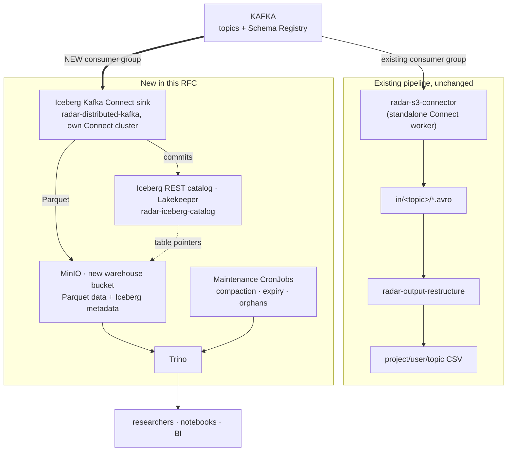

Summary
-------
This RFC proposes making RADAR-base's data **SQL-queryable**. Every Kafka topic is written into an [Apache Iceberg](https://iceberg.apache.org/) table on the object storage RADAR already runs, and queried with [Trino](https://trino.io/).

The new path is a second, independent consumer of the same Kafka topics. The existing S3 sink, the `in/` Avro archive and `radar-output-restructure` keep running untouched, so this is additive and reversible. Ingestion uses the Apache Iceberg **Kafka Connect sink**, deployed through the existing `radar-distributed-kafka` chart. It needs **no new RADAR code**, because the two record transformations it depends on are already published by RADAR in [`kafka-connect-transform-keyvalue`](https://github.com/RADAR-base/kafka-connect-transform-keyvalue). Everything is delivered as Helm charts and wired through Helmfile behind `_install` flags, so it is version-controlled like the rest of the deployment and can be switched off.

Motivation
----------
The archive side of RADAR-base ends in two file trees, and neither one can answer a question:

```
SOURCE (S3/MinIO)                        TARGET (S3/MinIO/disk)
in/<topic>/partition=N/                  <project>/<user>/<topic>/
   <topic>+<p>+<offset>.avro                20200528_1000.csv.gz
   (Kafka's layout, by topic)               (the researcher layout, by participant-hour)
```

Both are **archives**. Neither is a **database**.

Take a question a RADAR researcher actually asks: *"weekly mean heart rate per participant, for participants who also completed the PHQ-8"*. Answering it from these trees means listing many thousands of objects and paying for every LIST call. It means downloading every hour-file that might be relevant, because you cannot know which ones matter without opening them. Then unzipping and parsing each file, joining two topics in your own code, and hoping nothing was missed. Next month's question starts again from zero.

The underlying problem is worth naming, because it explains what a table format buys. **A file tree is a single frozen query.** The layout `${projectId}/${userId}/${topic}/${hour}` is one question compiled into folder names. Ask that question and the tree is perfect. Ask any other question and it offers nothing but a full scan.

**Measurable goals:**
- Any researcher question over any combination of topics becomes one SQL statement, with no download-and-parse script.
- Joins across topics become possible. Today that data is never brought together at all.
- Erasing one participant becomes a single statement per table, instead of a search through years of archives. This is the platform's hardest unsolved chore today.
- Query cost stops scaling with the size of the archive and starts scaling with what the query actually needs.
- Storage falls per unit of data, because Parquet with zstd is smaller than the same records as gzipped CSV.

Non-Goals
---------
- **Not** replacing the S3 sink, the `in/` archive or `radar-output-restructure`. They keep running. The `in/` archive stays the source of truth, and deprecating CSV is not proposed here.
- **Not** backfilling history. The sink writes from the moment it is switched on. Loading the historical `in/` archive is a separate job and a separate RFC.
- **Not** an assistant that writes SQL for you. The idea of letting a researcher ask a question in plain English, and having a model turn it into a query, is a separate piece of work. It has to come after the access control described below, because a tool like that can only be as safe as the permissions it is given.
- **Not** real participant data at the start. Until the controls in the Security and privacy section are built and approved, these tables hold only mock or test-project data.

Guide-level explanation
-----------------------

### What is added

One new branch off Kafka, three new services, and a new bucket. Nothing existing changes.



This is safe to start because a Kafka topic can be read by any number of independent consumer groups, each with its own position. The Iceberg sink cannot slow down, break, or even be noticed by the S3 sink reading the same topics. The one shared resource is Kafka's retention window. The sink has to stay caught up, watched with the same consumer-lag alert the S3 sink already lives under.

### What a researcher gets

One table per Kafka topic, in a `radar` namespace, queried by name:

```sql
SELECT projectId, userId, date_trunc('week', time) AS week, avg(heartRate)
FROM iceberg.radar.connect_fitbit_intraday_heart_rate
WHERE projectId = 'radar-test' AND time >= DATE '2026-01-01'
GROUP BY 1, 2, 3;
```

The tables declare `PARTITIONED BY (projectId, day(time))`, so that `WHERE` clause prunes by project and by day in metadata, before any data file is opened.

Reference-level design
----------------------

### Components and ownership

| # | Component | Chart today | This RFC |
|---|---|---|---|
| 1 | Kafka + Schema Registry | `charts/radar-kafka` | unchanged, we are a new consumer |
| 2 | MinIO | `external/minio` | values only: a new bucket and a scoped user |
| 3 | Postgres for the catalog | `charts/radar-cloudnative-postgresql` | values only: a cluster for the catalog |
| 4 | **Iceberg catalog (Lakekeeper)** | does not exist | vendor `external/lakekeeper`, new wrapper chart `charts/radar-iceberg-catalog` |
| 5 | **Connect worker running the sink** | `charts/radar-distributed-kafka` | backwards-compatible chart change, plus a second release |
| 6 | **Connect image** with the Iceberg plugin | not a chart | new image, built from a small Gradle project |
| 7 | **Trino** | does not exist | vendor `external/trino`, values only, no wrapper needed |
| 8 | **Maintenance CronJobs** | do not exist, there is no `kind: CronJob` anywhere in `charts/` | new chart `charts/radar-iceberg-maintenance` |
| 9 | Monitoring | `charts/kube-prometheus-stack` | values only: alert rules |

Four of the nine already exist and need values at most. Only three are genuinely new charts, and two of those are upstream charts vendored the way this repository already vendors third-party charts.

### Why Iceberg, and what the catalog is for

An Iceberg table is a **pointer, held by a catalog, to a tree of immutable files in a bucket**. A write adds new Parquet files that nothing references yet, writes new metadata, and then asks the catalog to swap the pointer, but only if it still points where the writer thinks it does. That conditional swap is the whole concurrency model. It is also why a catalog is mandatory rather than a convenience.

Two consequences shape the operational requirements below:

- **Losing the catalog database loses the tables.** Every byte survives in the bucket, but nothing knows which metadata file is current.
- **Nothing else may manage files in the warehouse bucket.** An S3 lifecycle rule that deletes old objects will delete files a live snapshot still references.

**Catalog pick: Lakekeeper.** Apache-2.0, a single Rust binary, state in Postgres. It works on-premise against MinIO, which matters because many RADAR deployments are self-hosted. It authenticates against an existing OIDC provider instead of growing its own user store. It can also express permissions per project, and pass the same rules to Trino. We do not need that immediately, but we must not be blocked from it later.

### Ingestion needs no new RADAR code

The sink writes the record **value**. RADAR's participant identity lives in the record **key** (`ObservationKey`), and RADAR's `time` is a `double` of epoch seconds, which Iceberg cannot partition by day. Both gaps are closed by transforms **RADAR already publishes and already runs in production** on the S3 sink:

| Transform | Source | Effect |
|---|---|---|
| `MergeKey` | `RADAR-base/kafka-connect-transform-keyvalue` | copies the key's fields into the value as `projectId`, `userId`, `sourceId` |
| `TimestampConverter` | same jar | converts double epoch-seconds fields into real timestamp columns |
| `InsertField`, `ReplaceField`, `TimestampConverter` | ship inside Kafka | topic routing, dropping an unwanted column, parsing string dates |

The resulting table for `android_phone_acceleration`:

```sql
radar.android_phone_acceleration (
    projectId varchar, userId varchar, sourceId varchar,
    time         timestamp(6) with time zone,   -- device time
    timeReceived timestamp(6) with time zone,
    x real, y real, z real, _topic varchar
)
WITH (partitioning = ARRAY['projectId', 'day(time)'])
```

There are two deliberate trade-offs. `TimestampConverter` rewrites `time` **in place**, so the raw double is not kept and precision becomes milliseconds. That is safe here, because RADAR's fastest topic samples at 51.2 Hz and nothing comes close to 1 kHz. Separately, `MergeKey` always adds a Kafka record-timestamp column and offers no way to turn it off, so the transform chain drops it with a stock `ReplaceField`.

### Topic coverage: six connectors, not 315

Counted from `RADAR-Schemas/specifications/`, there are **320 topics. Five are Kafka Streams outputs that can be derived in SQL, so they are excluded. That leaves 315 to ingest**: 73 `android_*`, 72 `questionnaire_*`, 69 `connect_*`, 38 `push_*`, 25 `active_*`, and the rest.

One connector per topic is not workable. In `radar-distributed-kafka`, **each entry under `connectors:` renders its own Deployment**, so 315 topics would mean 315 Connect worker pods. Instead each connector matches a family of topics with `topics.regex` and uses the sink's **dynamic routing**. A stock `InsertField` transform stamps the source topic into a `_topic` field, and the sink sends each record to the table named by that field, creating it if it does not exist. Six connectors cover all 315 topics.

`tasks.max` is a **ceiling, not a target**. RADAR runs 12 partitions per topic, so 315 topics is roughly 3,780 partitions. One consumer can hold hundreds of partitions without difficulty, so the six connectors run about 17 tasks across 6 pods. The real limit is memory. A task holds one open Parquet writer for every table and partition value it is currently writing, so the fix for heap pressure is splitting a connector's regex, not adding tasks.

### Event time: using the observation's own date

`iceberg.tables.default-partition-by` applies per connector, so topics grouped together have to share an event-time column. **306 of the 315 topics have `time`.** The nine that do not are Fitbit and Google Health sleep and daily-summary topics, and getting them wrong matters. Partitioning them by `timeReceived` would file a night's sleep under whichever day the device happened to sync, and every query for "that week" would quietly return the wrong rows.

`radar-output-restructure` already solved this. Its `TimeUtil.getDate` resolves a record's date in this order:

```
value.time → key.timeStart → key.start → value.dateTime → value.date
                                       → value.timeReceived → value.timeCompleted
```

`dateTime` and `date` come **before** `timeReceived`. This RFC follows the same order. A dedicated connector for those seven string-date topics parses `dateTime` (`yyyy-MM-dd'T'HH:mm:ss`) and `date` (`yyyy-MM-dd`) using Kafka's own `TimestampConverter`, then renames the result to `time`, so one partition spec covers every table. Two remaining topics, `connect_upload_altoida_assessment` and `connect_fitbit_time_zone`, have no usable event time at all. Their tables are created by hand, partitioned by `projectId` only.

That rename is confined to one connector on purpose. **Nine `push_garmin_*` topics have both `time` and `date`**, and renaming `date` to `time` there would collide with the column that already exists.

### Chart work in `radar-helm-charts`

- **`radar-distributed-kafka`, 0.1.0 to 0.2.0.** Two backwards-compatible changes. A `connectCluster` block makes `group.id` and the three internal topics configurable, with defaults that reproduce today's hardcoded values exactly. This is needed because workers sharing a group form one Connect cluster, whose leader can assign any connector to any member, so a release carrying a different image needs a cluster of its own. Second, `kafka.topic` is now only written when a `topic` is set. Sink entries have none, and the template previously rendered `"kafka.topic": null`, which Kafka Connect rejects. A `values-iceberg.yaml` ships the full six-connector configuration.
- **`radar-iceberg-catalog`, new.** Wraps `external/lakekeeper` and adds the three things upstream does not ship: a Secret for the warehouse credentials, a bootstrap Job that initialises the server and creates the `radar` warehouse and can safely run again, and a network policy in the house style.
- **`radar-iceberg-maintenance`, new.** Three CronJobs running Trino SQL. They discover tables with `SHOW TABLES`, so tables the sink creates later are maintained without any values change.
- **`external/lakekeeper` and `external/trino`.** Vendored with `make update-*` targets, following the convention already used for every other third-party chart.

### The plugin, and why an image is needed

Apache publishes **no downloadable Iceberg Connect plugin**. It is not on Confluent Hub, and `iceberg-kafka-connect-runtime` does not exist on Maven Central. The official instruction is to build Iceberg from source.

A Connect plugin is only ever a folder of jars, so a small Gradle project resolves the S3-only subset (`iceberg-kafka-connect`, `-core`, `-parquet`, `-aws`, `-aws-bundle`, and `hadoop-common` with the same exclusions upstream applies). A two-stage Dockerfile copies that folder, plus RADAR's transform jar, into a Connect image. Upstream's own runtime bundle also carries Azure, GCP, BigQuery, ORC, Glue and DynamoDB, none of which RADAR uses.

Compatibility and migration
---------------------------
- **Purely additive.** A new Kafka consumer group. No change to topics, schemas, the S3 sink, restructure, or the CSV tree.
- **Off by default.** Every new release ships `_install: false`. Connectors ship `enabled: false` and are turned on one at a time, starting with a low-volume topic and adding `android_phone_acceleration` last.
- **The existing chart's defaults are unchanged**, so current `radar-distributed-kafka` releases render identically after the 0.2.0 bump.
- **Storage cost rises during parallel running**, because the same data exists as Avro in `in/`, as CSV, and as Parquet. Parquet is the cheapest of the three, and the duplication is what makes the migration reversible.
- **Rollback is cheap.** Set `installed: false`, or pause the connector. To start over, delete the connector, drop the tables, delete the consumer group `connect-<name>`, and redeploy. Sink progress is an ordinary Kafka consumer group and table state is a catalog pointer, so there is no third place holding stale state.

Alternatives considered
-----------------------
- **Flink or Spark Structured Streaming for ingestion.** Both write Iceberg well, and both add a distributed runtime to deploy, upgrade, checkpoint and page someone for, in order to do what a connector in an existing Connect cluster already does. RADAR's ingest is a straight copy, not a stateful transformation. If that ever changes, Flink reads the same topics and writes the same tables.
- **Batch-converting the `in/` Avro tree on a schedule.** Tempting because it reuses accounting we already trust, but it inherits the archive's latency and file shape, and it ties the new path to code the platform eventually wants to retire.
- **Other catalogs.** A JDBC catalog has no authentication, authorization or credential vending, which is fine for a laptop and a dead end for participant data. Polaris is credible but heavier, younger to self-host, and its role-based grants are coarser than what "researcher X sees project Y only" needs. Nessie's main feature is git-like branching, which RADAR does not need. Glue is cloud-locked and fails the self-hosting requirement. Hive Metastore is the legacy answer, and only right if you already run one.
- **Delta Lake or Apache Hudi instead of Iceberg.** Iceberg is the most engine-neutral of the three, and its REST catalog API became the shared standard. Adopting it means adopting a specification rather than a vendor.
- **One connector per topic.** Rejected on pod count, as described above.
- **Partitioning the nine topics without `time` by `timeReceived`.** Rejected. It misfiles late-syncing sleep data, and RADAR's own restructure logic already prefers the observation's own date.

Operational considerations
--------------------------
**Maintenance is not optional.** Iceberg trades hard correctness problems for three cleanup jobs that have to be scheduled. A neglected table does not break. It degrades slowly. Queries get worse month by month, storage keeps every superseded byte, and deleted rows stay physically present.

| Chore | Cadence | If skipped |
|---|---|---|
| `optimize` (compaction) | daily, off-peak | small files multiply, so planning and compression both degrade |
| `expire_snapshots` | daily | metadata and storage grow forever, and deletes never become physical |
| `remove_orphan_files` | weekly | files from interrupted commits are billed forever |

**Monitoring**, into the existing Prometheus and Grafana:

| Metric | Why |
|---|---|
| consumer lag of `connect-<connector>` | the only failure that loses data. Lag beyond Kafka retention means records age out before they are written |
| connector and task state | a FAILED task is otherwise silent, and lag alone will not say why |
| **time since each maintenance job last succeeded** | the classic slow failure is a CronJob that has quietly not succeeded for weeks |
| snapshot and file count per table | these should rise and fall. A steady climb means maintenance is not working |
| warehouse bucket size | capacity planning, and an early signal that expiry is deleting nothing |

**Rollout order.** Each step is verifiable on its own, so they are not batched:

1. Publish the chart change.
2. Vendor the catalog and Trino charts.
3. Build and push the Connect image.
4. Create the bucket, the scoped user and the Secret.
5. Deploy and bootstrap the catalog.
6. Enable one connector on one small topic.
7. Confirm data lands and is queryable in Trino.
8. Add the maintenance CronJobs, before moving on rather than after.

**Known operational risks.** Compaction can race the sink's commits, which Iceberg resolves as a retry rather than corruption, but it is scheduled off-peak anyway. Trino memory sizing matters, because one bad cross join will OOM a worker. And the warehouse bucket must not be touched by an S3 lifecycle rule or a manual tidy-up, which would corrupt tables.

Security and privacy
--------------------
A SQL surface over participant data is **a new processing activity**, not the same bytes in a new format. One credential now answers any question over everything it can see, in seconds, including joins across topics that were never possible before. That is the point of the project. It is also why this needs a data protection impact assessment (DPIA) and an update to the record of processing activities, rather than an engineering ticket. That paperwork moves more slowly than the code, so it should start early.

- **Mock or test-project data only** until the controls below exist. Real participant data comes after sign-off.
- **Per-project isolation** rests on the `projectId` column, and is enforced at three layers. The catalog controls who may load which table. Trino applies row filters, and is the only layer that understands rows. Storage hands out short-lived, scoped credentials. The acceptance test is the negative one: a researcher on project A demonstrably cannot see project B, checked at all three layers.
- **No human holds warehouse bucket credentials.** Access is an OIDC login into Trino. The static keys used while this is being brought up are a first step. The end state is the catalog handing out short-lived credentials that expire on their own.
- **Erasure becomes possible.** `DELETE FROM ... WHERE userId = ?` per table, then snapshot expiry, which is the point at which the rows physically stop existing. Two caveats belong in the runbook. Between those two steps, time travel can still reach the rows. And the `in/` and CSV copies are unchanged, so the honest statement is that the new store supports erasure while the legacy stores do not.
- **Audit.** Trino query events and catalog audit events go to the existing log store. SQL access is more auditable than file downloads ever were, which is worth stating in the DPIA as a real improvement.

Testing strategy
----------------
- **Already proven end to end.** A docker-compose lab running Kafka, Schema Registry, MinIO, an Iceberg REST catalog, Kafka Connect and Trino has run this exact path with 10k records using real RADAR schemas. The table was auto-created and partitioned, rows were queryable in Trino, and time travel and row-level DELETE both worked.
- **No unit tests are owed**, because no RADAR code is written. The deliverable is configuration plus charts. Chart correctness is covered by `helm lint` and `helm template` against the shipped values files, including a check of the rendered connector JSON for null values.
- **Four experiments before widening past the first topic.** Exactly-once: kill the worker mid-flow, restart, and compare `count(*)` against what was produced. Schema evolution: register a FULL-compatible new version, produce with it, and watch the column appear while old rows read null. Late data: produce a record dated 30 days ago and confirm it lands in that day's partition. Delete and expiry: confirm that time travel to the pre-delete snapshot fails afterwards, which is the GDPR-relevant proof.
- **Per-connector validation** as each one is enabled. Identity columns present, `time` is a timestamp type, `$partitions` shows project and day, and the dead-letter queue stays empty. A null key would send records there rather than into the table.
- **Success metrics.** Lag stays near zero, file and snapshot counts rise and fall rather than climbing, and the query in the Motivation section returns the right answer against mock data.

Open questions
--------------
1. **When does catalog authentication get turned on?** The bootstrap Job assumes OIDC is off, which is fine for staging on mock data but has to change before real data. Who owns registering the identity-provider client?
2. **Embedded Postgres or CloudNativePG for the catalog?** The chart defaults to embedded for staging convenience, and production should use CloudNativePG. Either way this database needs a restore that has actually been tested, not just a backup.
3. **The time-travel retention window is a governance parameter, not a tuning knob.** It decides both how far back anyone can query and how long after a `DELETE` the data physically survives. Seven days is proposed, but the number needs agreeing rather than choosing.
4. **Where does the Connect image live, and what publishes it?** A new RADAR-base repository with CI publishing to ghcr.io is assumed.
5. **Is losing the raw double `time` acceptable to everyone downstream?** Millisecond precision is far finer than RADAR's fastest sampling rate, but the decision should be explicit rather than implied.
6. **Who operates this?** Maintenance jobs, catalog backups, on-call. An unmaintained Iceberg table degrades quietly, so this is a service rather than an export.
7. **Should the five Kafka Streams output topics ever be ingested** (`android_phone_usage_event_output`, `android_phone_usage_event_aggregated`, and three `source_statistics_*`), or permanently left as a `GROUP BY` in SQL?

References
----------
- Apache Iceberg: [table spec](https://iceberg.apache.org/spec/) and [Kafka Connect sink](https://iceberg.apache.org/docs/latest/kafka-connect/)
- [Lakekeeper](https://docs.lakekeeper.io/), the Iceberg REST catalog proposed here
- [Trino Iceberg connector](https://trino.io/docs/current/connector/iceberg.html)
- [RADAR-base/kafka-connect-transform-keyvalue](https://github.com/RADAR-base/kafka-connect-transform-keyvalue), providing `MergeKey` and `TimestampConverter`, already deployed on the S3 sink
- [RADAR-base/radar-s3-connector](https://github.com/RADAR-base/radar-s3-connector), the existing archive path this runs beside
- `radar-output-restructure`, `src/main/java/org/radarbase/output/util/TimeUtil.kt`, the event-time order this RFC follows
- RADAR-Schemas `specifications/`, the topic inventory the connector grouping is derived from
